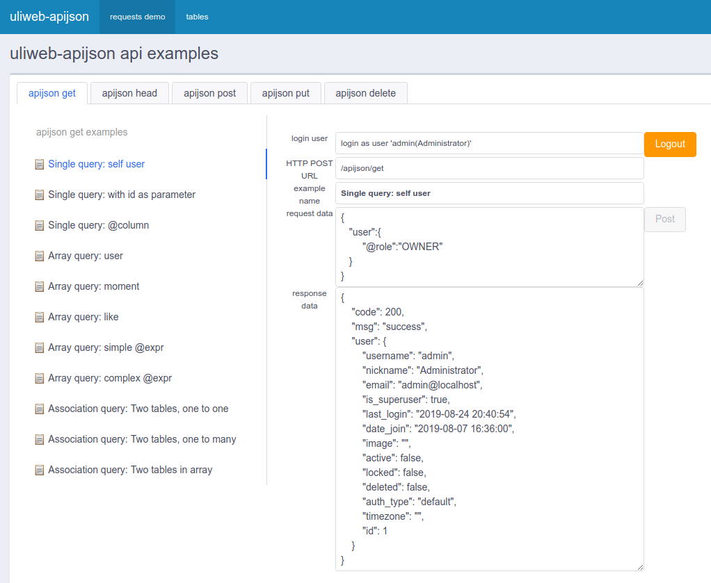

## How to run uliweb-apijson demo?

pip install dependent packages, in demo root directory run:

```
pip install -r requirements.txt
```

In demo root directory,run commands to init db:

```
uliweb syncdb
uliweb dbinit
```

In demo root directory, run debug server:

```
uliweb runserver
```

Then you can access http://localhost:8000 to try demo.

Users in demo for test: **admin**/**usera**/**userb**/**userc** , password: **123**


